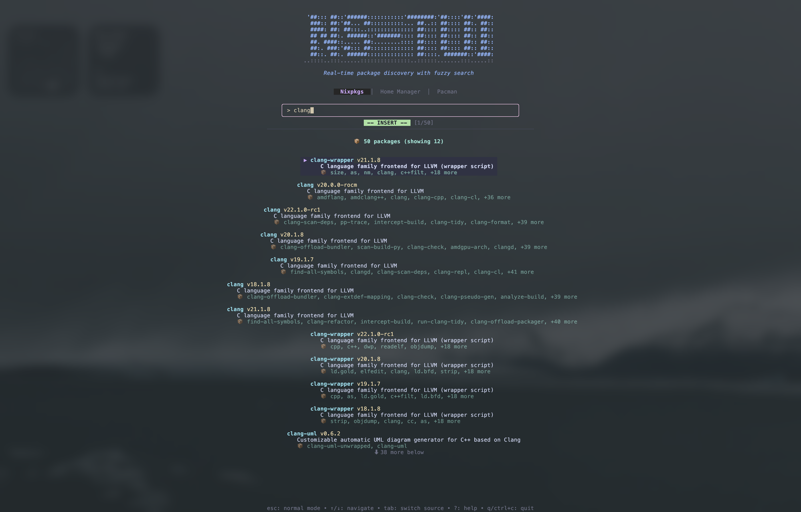

<div align="center">

<pre>
<span style="color: #89b4fa; font-weight: bold;">'##::: ##::'######:::::::::::'########:'##::::'##:'####:</span>
<span style="color: #89b4fa; font-weight: bold;"> ###:: ##:'##... ##::::::::::... ##..:: ##:::: ##:. ##::</span>
<span style="color: #89b4fa; font-weight: bold;"> ####: ##: ##:::..:::::::::::::: ##:::: ##:::: ##:: ##::</span>
<span style="color: #89b4fa; font-weight: bold;"> ## ## ##:. ######::'#######:::: ##:::: ##:::: ##:: ##::</span>
<span style="color: #89b4fa; font-weight: bold;"> ##. ####::..... ##:........:::: ##:::: ##:::: ##:: ##::</span>
<span style="color: #89b4fa; font-weight: bold;"> ##:. ###:'##::: ##::::::::::::: ##:::: ##:::: ##:: ##::</span>
<span style="color: #89b4fa; font-weight: bold;"> ##::. ##:. ######:::::::::::::: ##::::. #######::'####:</span>
<span style="color: #6c7086;">..::::..:::......:::::::::::::::..::::::.......:::.....::</span>
</pre>

### **The fastest way to discover & install Nixpkgs, Home manager options**

*Search, explore, and copy install commands in seconds — all from your terminal*

[](https://github.com/briheet/ns-tui/releases/latest)
[](https://github.com/charmbracelet/bubbletea)
[](https://go.dev/)
[](LICENSE)

</div>

---

<div align="center">




</div>

## ✨ Why ns-tui?

Stop switching between browser tabs and terminal windows. **ns-tui** brings the entire NixOS package ecosystem to your fingertips with:

- **⚡ Instant fuzzy search** — typos? No problem. "lezygit" finds "lazygit"
- **🎯 Zero context switching** — search, explore, and install without leaving your terminal
- **⌨️ Vim keybindings** — navigate like a pro with familiar j/k motions
- **📋 One-click copying** — choose from 4 install methods, hit Enter, done
- **🎨 Beautiful UI** — Catppuccin theme that's easy on the eyes
- **💨 Blazing fast** — real-time results powered by official NixOS search

## 🚀 Quick Start

### Option 1: Download Pre-built Binary (Easiest)

Download the latest release for your platform from [GitHub Releases](https://github.com/briheet/ns-tui/releases/latest):

### Option 2: Install with Go

```bash
go install github.com/briheet/ns-tui/cmd/ns-tui@latest
```

### Option 3: Run with Nix

```bash
nix run github:briheet/ns-tui
```

Then just run:
```bash
ns-tui
```

**That's it.** Start typing to search, press `?` for help.

## 💡 How to use

1. **Type** to search packages (fuzzy matching enabled)
2. **Navigate** with `j`/`k` or arrow keys
3. **Press Enter or Space** to view package details
4. **Tab** through install methods
5. **Space/Enter** to copy the command

**Pro tip:** Press `?` anytime for the complete keybindings guide.

## 🎯 Perfect for

- **NixOS beginners** who want to discover packages easily
- **Power users** who prefer terminal workflows
- **Anyone tired** of slow browser-based package search
- **Developers** who value speed and efficiency

## 🛠️ Installation Methods

<details>
<summary><b>Pre-built Binaries</b> (recommended)</summary>

Download from [GitHub Releases](https://github.com/briheet/ns-tui/releases/latest) for your platform:

**Available for:**
- Linux (amd64, arm64)
- macOS (amd64, arm64)
- Windows (amd64, arm64)

```bash
# Example for macOS arm64
curl -LO https://github.com/briheet/ns-tui/releases/latest/download/ns-tui_<version>_darwin_arm64.tar.gz
tar -xzf ns-tui_<version>_darwin_arm64.tar.gz
sudo mv ns-tui /usr/local/bin/
```
</details>

<details>
<summary><b>Via Go Install</b></summary>

```bash
go install github.com/briheet/ns-tui/cmd/ns-tui@latest
```

Make sure `$GOPATH/bin` is in your `$PATH`.
</details>

<details>
<summary><b>With Nix Flakes</b></summary>

```bash
# Run directly
nix run github:briheet/ns-tui

# Or build locally
nix build
```
</details>

<details>
<summary><b>From Source</b></summary>

```bash
git clone https://github.com/briheet/ns-tui.git
cd ns-tui
go build -o bin/ns-tui ./cmd/ns-tui
```
</details>

## 🎨 Features at a Glance

| Feature | Description |
|---------|-------------|
| 🔍 **Fuzzy Search** | Smart search that handles typos and partial matches |
| 📦 **Rich Details** | See version, description, programs, and platform support |
| ⌨️ **Vim Bindings** | Modal interface (Insert/Normal/Detail modes) |
| 💬 **Live Feedback** | Toast notifications, loading spinners, package counters |
| 🎯 **4 Install Methods** | nix-shell, NixOS config, nix-env, nix profile |
| 🌐 **Official Data** | Powered by search.nixos.org backend |
| 📱 **Responsive** | Adapts to your terminal size |

## ⭐ Love ns-tui?

- **Star this repo** to show your support
- **Share with friends** who use NixOS
- **Contribute** — PRs welcome!

## 📄 License

MIT License - see [LICENSE](LICENSE) for details.

---

<div align="center">

[Report Bug](https://github.com/briheet/ns-tui/issues) · [Request Feature](https://github.com/briheet/ns-tui/issues)

</div>
